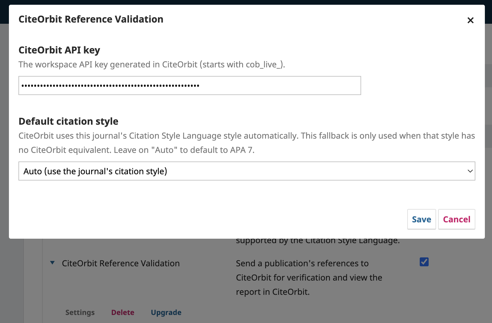
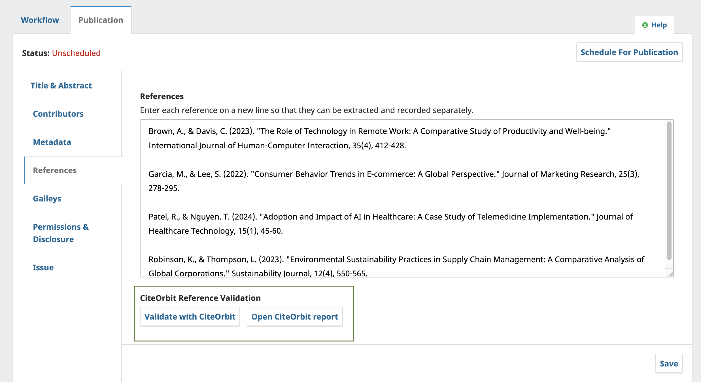
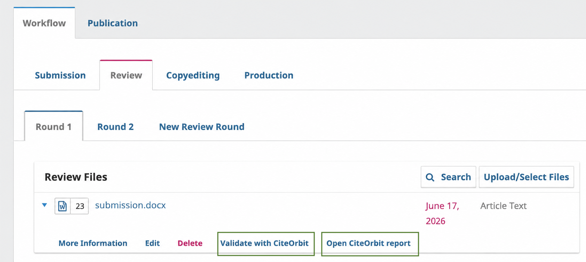

# CiteOrbit Reference Validation — OJS Plugin

A generic plugin for **OJS 3.4** that sends a submission's references or a full
manuscript file to [CiteOrbit](https://app.citeorbit.com) for citation
verification, then links the editorial UI straight to the report.

Editors get two one-click actions inside the normal OJS workflow:

- **Validate references** — checks the citations entered on a publication's
  *References* tab.
- **Validate a file** — checks the references inside an uploaded DOCX
  manuscript.

Each check spends credits from the CiteOrbit workspace the journal's API key
belongs to, and the resulting report opens in CiteOrbit.

---

## How

### 1. Settings — paste your CiteOrbit API key
The key is entered as a password field, so it is never shown in clear text.

### 2. Validate references (publication *References* tab)
A **Validate with CiteOrbit** button is added below the citations list. After a
check runs, an **Open CiteOrbit report** link appears next to it.

### 3. Validate a manuscript file (workflow file grids)
Every DOCX file row gets a **Validate with CiteOrbit** action. Once
validated, an **Open CiteOrbit report** link is shown on that row.

### 4. The CiteOrbit report
The **Open CiteOrbit report** link opens CiteOrbit in a new tab; sign in to view
the full verification report there.

---

## Requirements

- **OJS 3.4** (uses 3.4 hooks, schemas, and Form Builder fields).
- A **CiteOrbit account** with an API-key-enabled workspace.
- The OJS server must be able to reach your CiteOrbit instance over HTTPS
  (`https://app.citeorbit.com` in production).

---

## Configuration

1. **Create an API key in CiteOrbit.**
   In CiteOrbit, open **Profile → API Keys → New Key**, give it a name
   (e.g. *"OJS – Journal of X"*), choose its permissions
   (**Validate references** and/or **Validate files**), and copy the key shown
   once (it starts with `cob_live_`).

2. **Paste the key into the plugin.**
   In OJS, open the plugin's **Settings** and paste the key into
   **CiteOrbit API key**. Optionally pick a **Default citation style** — this is
   only used as a fallback; CiteOrbit normally follows the journal's own CSL
   citation style automatically.

3. Save. You're ready to validate.

---

## Usage

### Validate references

1. Open a submission's **Workflow → Publication → References**.
2. Click **Validate with CiteOrbit**.
3. Confirm in the dialog (it shows how many references will be sent and warns
   that credits will be used).
4. You'll get a "References sent to CiteOrbit" notification. When the report is
   ready, click **Open CiteOrbit report**.

### Validate a manuscript file

1. Open any workflow stage with files (Submission, Review, Copyediting,
   Production).
2. On a **DOCX** file row, open the row actions and choose
   **Validate with CiteOrbit**.
3. Confirm. After processing, an **Open CiteOrbit report** link appears on the
   row.

---

## Troubleshooting

| Symptom | Likely cause / fix |
|---|---|
| Buttons don't appear | Plugin not enabled, or template cache stale — enable it and run `clearCache.php`. |
| "CiteOrbit connection failed — check plugin settings" | API key missing/incorrect, or revoked in CiteOrbit. Generate a new key and re-save. |
| "This CiteOrbit API key is not permitted to validate …" | The key lacks the needed scope. In CiteOrbit, create a key with **Validate references** and/or **Validate files** enabled. |
| "Your CiteOrbit workspace is out of credits." | Top up credits in CiteOrbit (Profile → Billing). |
| "Too many requests…" / "reached its daily limit" | Rate limit / per-key cap hit — wait and retry. |
| Report link is grey/unclickable | Reload the workflow page so the link-action JS binds. |

---

## License

Released under the [GNU General Public License v3.0](LICENSE).
